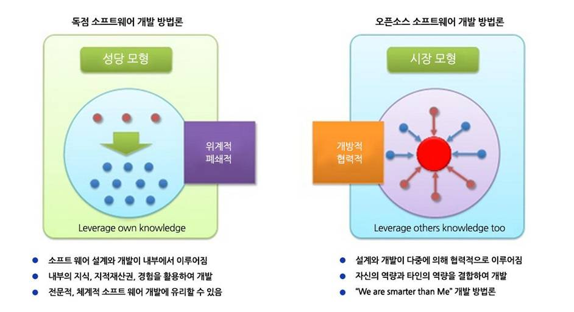

## 오픈소스의 특징

오픈소스는 ‘오픈’이라는 말 그대로 누구나 자유로운 이용과 배포가 가능하도록 오픈되어 있는 소스이다. 이는 자유, 공개, 비차별이라는 특성을 이끌어내며 더 나아가, SW 생태계의 새로운 혁신을 이끌어내고 있다. 오픈소스가 갖는 철학적 의미는 SW의 상업화가 아니라 누구나 자유로운 이용과 배포가 가능한 SW를 공유한다는 것이다. 독점 소프트웨어의 클로즈드 소스와는 달리 오픈소스는 일반에 공개되어 있기 때문에 진입장벽이 낮다. 이러한 특성은 많은 변화를 만들어내고 있다. 예를 들면, 과거 SI가 주류를 이루던 이전의 소프트웨어 개발은 체계적이고 전문적인 개발 형태가 다수였다. 그래서 하나가 완성되면 그 다음 순서로 넘어가고 그 다음 것이 완성되면 또 그 다음이 수행되는 선형적 구조의 개발형태였다면, 오픈소스 중심의 프로젝트의 경우는 내/외부의 협력이 모여 하나의 SW을 만드는 비선형적 구조이다. 때문에, 개발이나 안정화 시간이 짧으며, 결과적으로 비용절감이나 최적화된 리소스 활용, 효율성 향상의 이점을 가져오게 된다.

### 그림 1

 

출처: 오픈소스컨설팅

그림1을 보면, 독자적인 소프트웨어 개발은 외적인 요소는 배제되고 철저히 내부적 요소로만 개발이 되기 때문에 소프트웨어공학에는 가장 잘 어울리는 모델이지만 최근의 트렌드와는 다소 동떨어진 것으로 볼 수 있다. 또한, 요구사항에 가장 적합할 수는 있지만 개발 시간도 오래 걸리고 안정화 되는데도 매우 오래 걸리는 단점이 있습니다. 반면에 우측의 오픈소스 모델은 프로젝트 내외부에서 필요한 부분을 협력하면서 개발하기 때문에 개발이나 안정화 시간이 짧다. 거기에서 비용절감이나 최적화된 리소스 활용, 효율성 향상 등이 기대될 수 있다.

### 그림 2

그림 2에서 볼수 있듯이 오픈소스를 사용하는 이유는 비용절감이 가장 크고 종속성 탈피, 효율적인 비즈니스 환경 구현 순으로 다양하게 나타나고 있다. 이러한 니즈들을 크게 4가지로 분류할 수 있다.

#### 1. 오픈소스를 통해 비용절약을 할 수 있다.
- 오픈소스는 무료이다. 다양한 프로그램을 무료로 쓰면서, 이에 따른 비용을 절감할 수 있다. 특히 일반사용자 뿐만 아니라 기업의 경우에는 수십 수백 카피가 된다면 엄청난 비용을 절약할 수 있다.
- 많은 사람들이 이용하고 자유롭게 수정할 수 있기 때문에 버그 수정이 빠르게 진행된다. 여러 사람의 의견을 수렴하면서 저렴한 서비스를 제공할 수 있다. 뿐만 아니라, 소스코드 및 라이브러리의 재사용으로 개발시간이 단축되어 생산성이 향상된다.
- 뛰어난 외부개발자들의 참여가 가능해지면서, 세계적 수준의 소프트웨어를 빠른 속도로 개발이 가능해진다.

#### 2. 특정 OS나 특정 애플리케이션에 종속되지 않는다.
- 클로즈드 소스 SW라면, 해당 SW를 무조건 써야하며 이와 관련된 프로그램 또한, 해당 SW에서 제공하는 프로그램만을 사용하여야 한다. 또한 관련 프로그램도 호환이 되는 특정 기업의 프로그램만 사용가능 하여, 특정 OS나 애플리케이션에 종속되기 쉽다. 하지만, 오픈소스라면 다른 OS로 다른 애플리케이션으로 자유롭게 갈아타기가 가능하다.

#### 3. SW의 보안성이 강화된다.
- 소스코드가 공개되어 있는 경우라면 투명하게 누구나 코드를 보고 문제가 되는 부분을 찾고 공유할 수가 있다. 하지만, 상용 프로그램의 경우 사용자에게 전달되는 것은 단지 바이너리로 된 파일이다. 누군가에 의해 발견된 취약점이 있다고 하더라도 이것이 공유되지 않는다면 잠재적인 위협으로 남게 된다. 즉, 더 큰 위협이 될 수가 있다는 것이다. 오픈소스는 이와 반대로 소스코드가 공유되어 있으므로 취약점이 보고되면 취약점이 빠르게 해결되는 편이다.
- 오픈소스 SW는 소스코드가 공개되어 다수의 전문가들이 보안취약성을 검토해 오히려 보안이 강화되는 효과가 있다. 클로즈드 소스 SW와는 달리 커뮤니티에서 신속한 패치가 이루어진다. 

#### 4. 오픈소스는 호환성이 뛰어나다.
- 유료, 특히 MS의 경우 독자적인 파일 포맷을 고집해서 일부러 호환성을 떨어뜨려서 시장을 독점하려는 경향이 있다. 오픈소스는 파일 포맷도 오픈되어 있으며, 다양한 개발자들이 자신의 개발 환경에 맞는 오픈소스 프로그램을 개발하기 때문에 뛰어난 호환성을 자랑한다.

이러한 오픈소스의 장점들은 현재 IT업계에서 오픈소스 SW의 위상을 만들어낸 주요한 원인이 되었다. **“백지장도 맞들면 낫다”**라는 속담처럼 소프트웨어 개발은 팀 단위로 진행되는 것이 일반적이다. 소프트웨어를 협업 형태로 개발하면 토론을 통해 올바른 방향을 선택할 수 있으며, 미처 발견하지 못한 코드 오류를 훨씬 수월하게 찾을 수 있다. 적게는 몇 명에서, 많게는 수백·수천 명의 개발자가 협업하는 오픈소스는 이러한 장점을 극대화한 형태라고 할 수 있다. 오픈소스는 소스코드를 공개하여 해당 프로젝트에 관심있는 누구나 끌어들일 수 있다. 이러한 자율성은 오픈소스에 대한 관심이 날로 높아지게 만드는 주요한 특징이기도 하다.

#### 출처
- 정보산업진흥원: http://www.sw-eng.kr/member/customer/Webzine/BoardView.do?boardId=00000000000000047136&currPage=&searchPrefaceId=&titOrder=&writeOrder=&regDtOrder=&searchCondition=TOT&searchKeyword=

- 삼성뉴스룸: https://news.samsung.com/kr/%EC%86%8C%ED%94%84%ED%8A%B8%EC%9B%A8%EC%96%B4%EB%8F%84-%EB%A7%9E%EB%93%A4%EB%A9%B4-%EB%82%AB%EB%8B%A4-%EA%B0%88%EC%88%98%EB%A1%9D-%ED%9E%98-%EC%96%BB%EB%8A%94-%EC%98%A4%ED%94%88%EC%86%8C